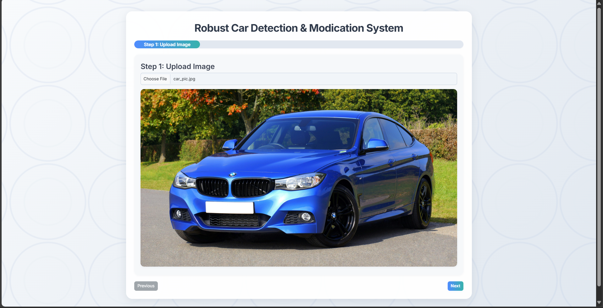
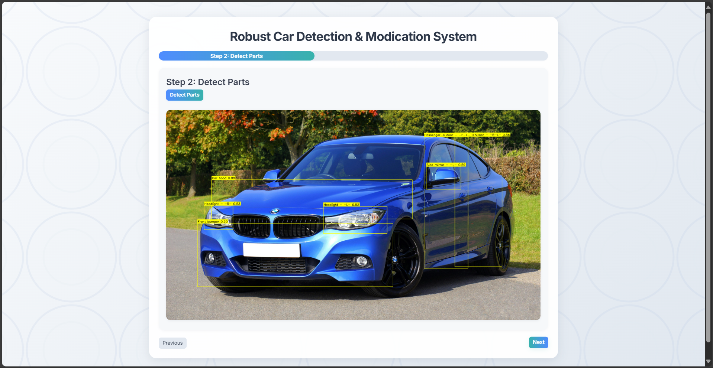
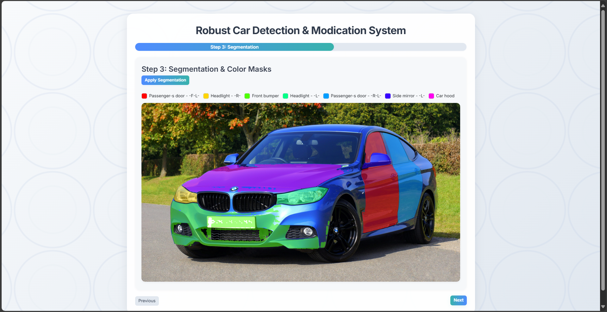
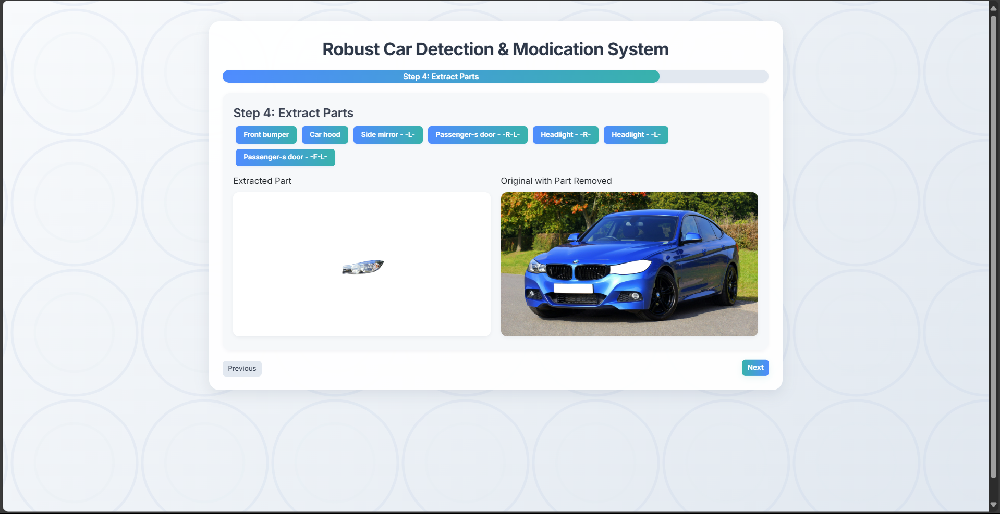
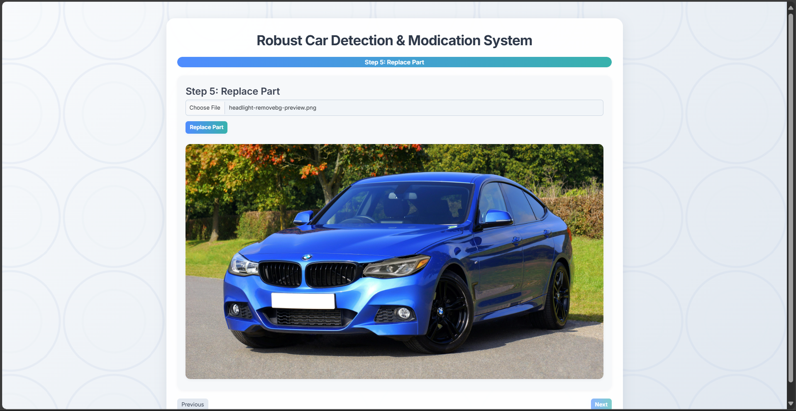

# Robust Car Detection & Modification System

**AI-Powered Car Part Detection & Modification, Made Effortless.**

---

## Table of Contents
- [Overview](#overview)
- [Features](#features)
- [Demo](#demo)
- [How It Works](#how-it-works)
- [Tech Stack](#tech-stack)
- [Setup Instructions](#setup-instructions)
- [Usage Guide](#usage-guide)
- [Folder Structure](#folder-structure)

- [License](#license)


---

## Overview

This project is an end-to-end web platform that leverages state-of-the-art AI to detect, segment, extract, and visually modify car parts in images. Designed for automotive professionals, insurance companies, car enthusiasts, and researchers, it provides a seamless workflow from image upload to part replacement—all in your browser.

---

## Features
- **Advanced Detection:** YOLO-based car part detection with high accuracy.
- **Interactive Segmentation:** Visualize and select car parts with color-coded masks.
- **Part Extraction & Removal:** Instantly extract or mask out detected parts.
- **Visual Replacement:** Upload and blend new parts into the original image.
- **Modern UI:** Beautiful, responsive, and intuitive interface inspired by industry leaders.
- **Secure & Private:** All processing is local to your session; your data is never shared.

## Supported Car Part Classes

Our fine-tuned YOLOv8 model can detect the following 20 car part classes:

| #  | Class Name                        |
|----|-----------------------------------|
| 1  | Car boot                          |
| 2  | Car hood                          |
| 3  | Driver-s door - -F-R-             |
| 4  | Fender - -F-L-                    |
| 5  | Fender - -F-R-                    |
| 6  | Fender - -R-L-                    |
| 7  | Fender - -R-R-                    |
| 8  | Front bumper                      |
| 9  | Headlight - -L-                   |
| 10 | Headlight - -R-                   |
| 11 | Passenger-s door - -F-L-          |
| 12 | Passenger-s door - -R-L-          |
| 13 | Passenger-s door - -R-R-          |
| 14 | Rear bumper                       |
| 15 | Rear light - -L-                  |
| 16 | Rear light - -R-                  |
| 17 | Side bumper - -L-                 |
| 18 | Side bumper - -R-                 |
| 19 | Side mirror - -L-                 |
| 20 | Side mirror - -R-                 |


---

## Workflow Screenshots

Follow the step-by-step workflow below to see the system in action:

### 1. Upload Car Picture
Upload any car image to get started.


### 2. Detect Car Parts (20 Classes)
Our fine-tuned YOLOv8 model detects and labels 20 different car parts.


### 3. Apply Segmentation & Color Masking
Use SAM to segment and color-mask each detected part for easy selection.


### 4. Extract Part to Modify
Select and extract the car part you want to modify.


### 5. Apply Modification & View Result
Upload a replacement or modified part and view the final result.


---

## How It Works

1. **Landing Page:** Welcomes users with a modern, animated design and a clear call to action.
2. **Step-by-Step Workflow:**
   - **Upload Image:** Start with any car image.
   - **Detect Parts:** AI model finds and labels car parts with visible bounding boxes.
   - **Segmentation:** Color-coded masks highlight each part for easy selection.
   - **Extract/Remove:** Instantly extract or mask out any detected part.
   - **Replace:** Upload a new part image and blend it into the original.
3. **Results:** Download or share your modified image.

---
### [Workflow Screenshots](https://universe.roboflow.com/test-bkrty/carpartsannotations/dataset/1)
---

## Tech Stack
- **Frontend:** HTML5, CSS3, Bootstrap 5, JavaScript (vanilla)
- **Backend:** Python 3, Flask
- **AI Models:**
  - YOLO (for detection)
  - SAM (Segment Anything Model)
  - PyTorch, OpenCV, NumPy
- **Other:**
  - Responsive design
  - SVG pattern backgrounds

---

## Setup Instructions

1. **Clone the Repository**
   ```bash
   git clone https://github.com/ShahxHussain/RCDMS
   cd "RCDMS"
   ```
2. **(Optional) Create a Virtual Environment**
   ```bash
   python -m venv ml
   # On Windows:
   ml\Scripts\activate
   # On Mac/Linux:
   source ml/bin/activate
   ```
3. **Install Dependencies**
   ```bash
   pip install -r requirements.txt
   ```
   _If you don't have a requirements.txt, install at least:_
   ```bash
   pip install flask ultralytics segment-anything opencv-python numpy pillow matplotlib
   ```
4. **Run the App**
   ```bash
   python app.py
   ```
5. **Open in Browser**
   - Go to [http://127.0.0.1:5000/](http://127.0.0.1:5000/) to see the landing page.

---

## Usage Guide


1. **Step 1:** Upload a car image.
2. **Step 2:** Click "Detect Parts" to see bounding boxes and labels.
3. **Step 3:** Click "Apply Segmentation" for color-coded masks.
4. **Step 4:** Select and extract/remove parts as needed.
5. **Step 5:** Upload a replacement part and blend it in.
6. **Download or share** your results!

---

## Folder Structure
```
RCDMS/
├── Screenshots/
├── training/
├── app.py
├── requirements.txt
├── static/
│   ├── js/
│   │   └── main.js
│   ├── uploads/
├── templates/
│   ├── landing.html
│   └── index.html
├── car_parts_detector.pt
├── sam_vit_h_4b8939.pth
├
└── ...
```

---

- **Special Thanks:** To the hackathon organizers.

---

## License

MIT

---
